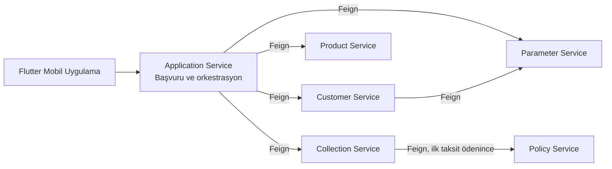

# Sigorta Otomasyonu: Mikroservis Mimarisi

AgeSA'daki uzun dönem stajım sırasında **bireysel olarak** geliştirdiğim, mikroservis tabanlı bir sigorta başvuru ve tahsilat sisteminin mimari özeti. Sistem, müşteri kaydından poliçe oluşumuna uzanan akışı 6 ayrı Spring Boot servisi ile modeller.

Bu repo yalnızca mimariyi ve servislerin kod bağlantılarını içerir. Kodlar servislerin kendi repolarındadır.

> Geliştirme sürecinde yapay zeka araçlarından öğrenme amaçlı yararlandım.

## Mimari

Servisler arası senkron iletişim **OpenFeign** ile yapılır. Her servis kendi MySQL şemasını kullanır (servis başına veritabanı yaklaşımı).

## Uçtan Uca Akış

1. Kullanıcı kayıt olur ve giriş yapar (Customer Service, JWT).
2. Ürün, fiyat ve teminat bilgileri Product ve Parameter servislerinden alınır.
3. Application Service başvuruyu oluşturur, risk ve prim hesabını yapar.
4. Başvuru kaydedildikten sonra Collection Service peşin veya taksitli ödeme planını oluşturur.
5. İlk taksit ödendiğinde Policy Service poliçe kaydını oluşturur.

## Servisler

| Servis | Görevi | Repo |
|---|---|---|
| **Customer** | Kayıt, giriş, müşteri profili. JWT üretimi, BCrypt ile şifreleme, TCKN algoritmik doğrulama, e-posta/TCKN benzersizlik kontrolü. Adres bilgilerini Parameter servisiyle doğrular. | [customer-micro-service](https://github.com/1omeralkan/customer-micro-service) |
| **Parameter** | Ülke/şehir/ilçe referans verileri, ödeme tipleri ve taksit aralıkları, risk parametreleri, teminat çarpanları. | [parameter-micro-service](https://github.com/1omeralkan/parameter-micro-service) |
| **Product** | Kategori, ürün, ürün tutarı ve teminatlar. Aktif fiyat `expiryDate is null` mantığıyla belirlenir, yeni fiyat girilince önceki fiyat kapatılır. | [product-micro-service](https://github.com/1omeralkan/product-micro-service) |
| **Application** | Başvuru sürecinin ana servisi. Diğer servisleri Feign ile çağırır, `APP-YYYY-0001` formatında başvuru numarası üretir, taksit sayısını ödeme tipine göre doğrular, risk ve prim hesabını yapar. | [application-micro-service](https://github.com/1omeralkan/application-micro-service) |
| **Collection** | Peşin/taksitli tahsilat satırları, taksit tutarı hesabı, önceki taksit ödenmeden sonrakini engelleyen kural, mock ödeme akışı. İlk taksit ödenince Policy servisini çağırır. | [collection-micro-service](https://github.com/1omeralkan/collection-micro-service) |
| **Policy** | Ödeme sonrası poliçe kaydı, müşteri bazlı poliçe listeleme, teminat kayıtları. Silme işlemi soft delete ile yapılır. | [policy-micro-service](https://github.com/1omeralkan/policy-micro-service) |

### Risk ve prim hesaplama

Application Service, Product servisinden gelen aktif ürün tutarını temel alır. Parameter servisinden risk parametrelerini alarak BMI, yaş ve cinsiyete göre çarpanı artırır. Çarpan eşik değeri aşarsa sağlık raporu gerekliliği işaretlenir. Seçilen teminatlar, teminat çarpanlarıyla başvuruya bağlanır.

## İstemciler

| İstemci | Teknoloji | Repo |
|---|---|---|
| Mobil | Flutter, Dio, Cubit | [alkan-sigorta-mobile](https://github.com/1omeralkan/alkan-sigorta-mobile) |
| Web | React, TypeScript | [alkan-sigorta-web](https://github.com/1omeralkan/alkan-sigorta-web) |

Mobil uygulama giriş, kayıt, başvuru, ödeme ve poliçe ekranlarını içerir. Web ve mobil arayüzler yapay zeka desteğiyle temel seviyede geliştirilmiştir.

## Teknolojiler

- **Backend:** Java 17, Spring Boot, Spring Data JPA / Hibernate, OpenFeign
- **Veritabanı:** MySQL (her servis için ayrı şema), şema yönetimi Liquibase ile
- **Güvenlik:** JWT, BCrypt
- **Dokümantasyon:** Swagger / OpenAPI
- **Kalite:** JUnit, Mockito, SonarQube, Bean Validation, global exception handler

## Ortak Servis Yapısı

Tüm servisler benzer katmanlı yapıdadır: Controller, Service, Repository ve DTO/Mapper. Doğrulama ve özel exception yapılarıyla hatalar standartlaştırılmıştır.
